# TRIMAZKON

  

- Vývoj aplikace byl zpočátku směrován pro zpracování velkých objemů obrázkových dat z průmyslových kamer na výrobních linkách.
- Dále se vyvinuté GUI postupně doplňovalo i o další pomocné programy.
- V současnosti je aplikace rozdělena na tři subaplikace:
	- TRIMAZKON.exe
	- jhv_MAZ.exe
	- jhv_IP.exe

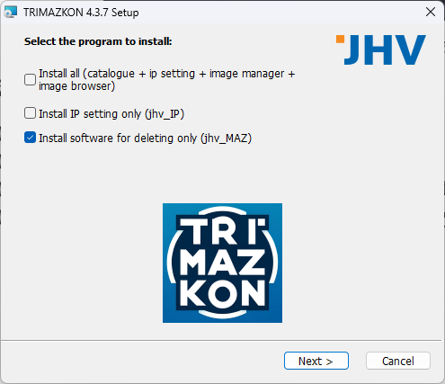

## Obecné vlastnosti aplikace:
- vlastní .msi installer
- licencování podle HWID
- JSON konfigurace
- autoupdate (Sharepoint)
- pipeline komunikace
- nabídka v System Tray (tray ikonka):

  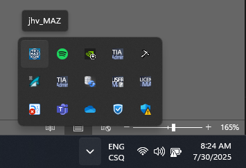

- Windows baloon tip (oznámení)
- čtení z SQL databáze
- tooltip (doplňující informace pod kurzorem nad tlačítky)

  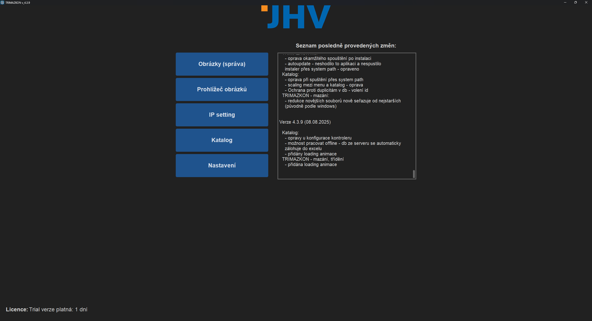

## Hlavní funkce aplikace
### Práce se soubory:
- Konverze souborů (obrázky se suffixem .ifz) pomocí externí aplikace do .jpg nebo .bmp

  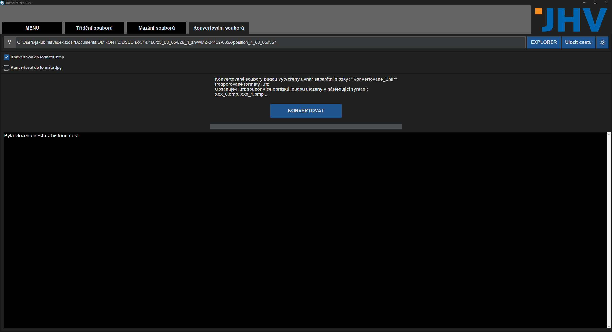

- Třídění podle syntaxe/vzorů názvů souborů, třídění párů apod.

  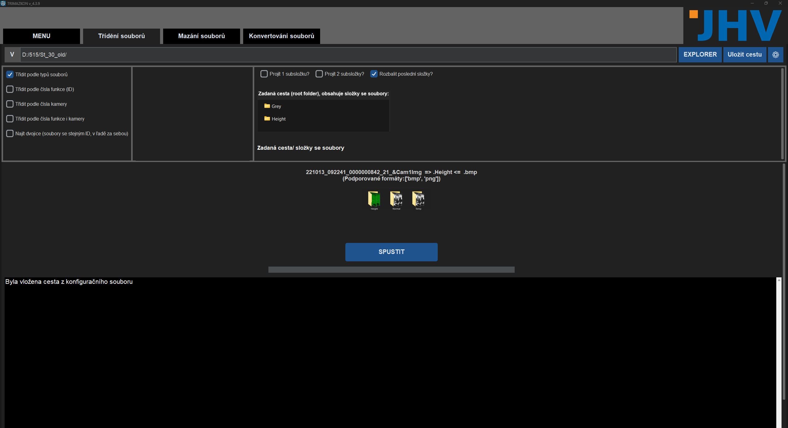

- Mazání souborů jako služba na pozadí (využívá task scheduler, Windows baloon tip)
  - ukládá log mazání

  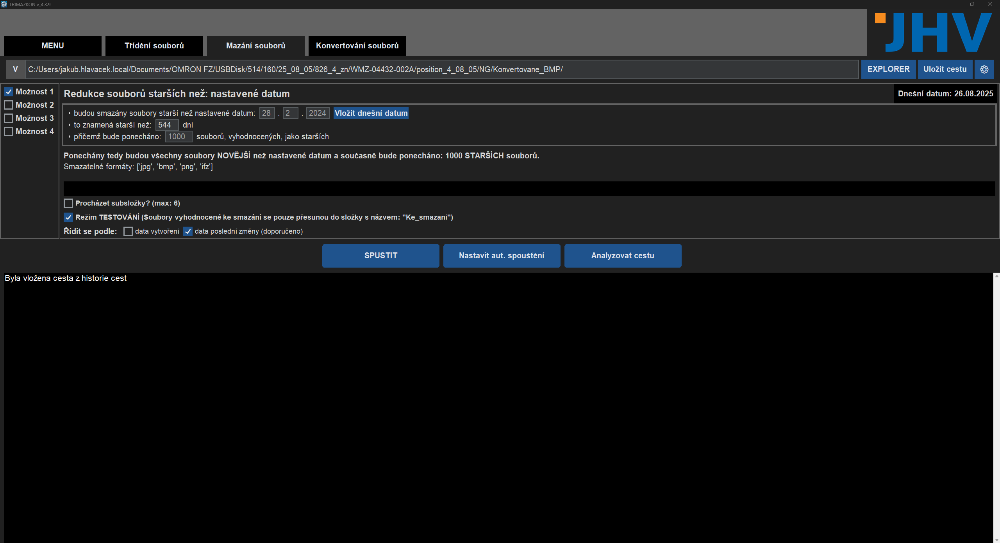

  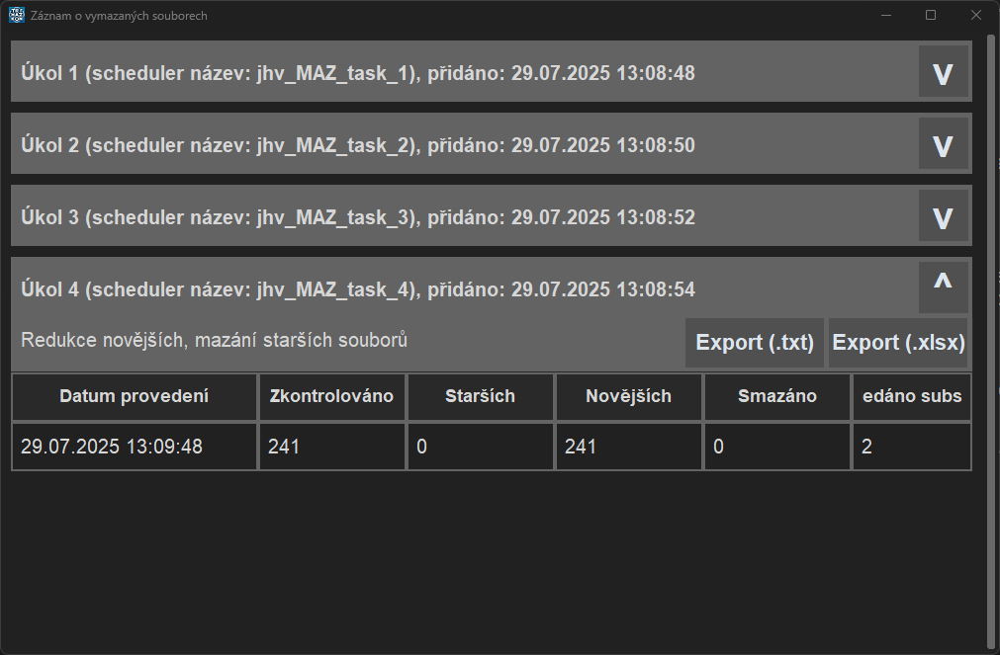

### Prohlížeč obrázků na míru s podporou speciálních formátů (.ifz)
- lze nastavit jako základní prohlížeč obrázků
- malování přes obrázek (pro poziční kontroly)
- možnost otevření obrázku v dalším okně

  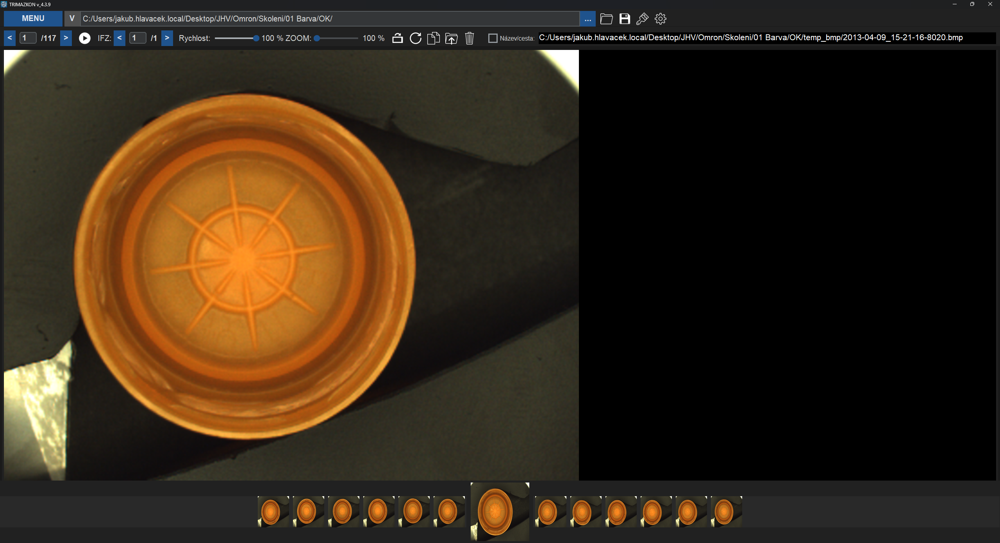

### Pomocník pro nastavování IP adresy počítače a mapování disků
- ukládá vložené adresy/ disky do .xlsx souboru, možné doplnit poznámkami
- možnost importu .xlsx
- adresu lze měnit přes nabídku tray icons

  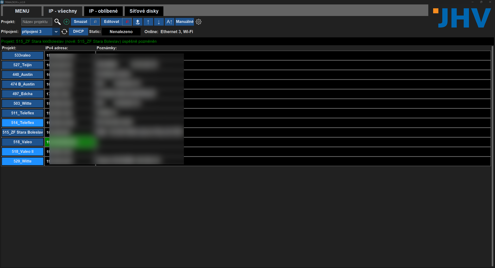

  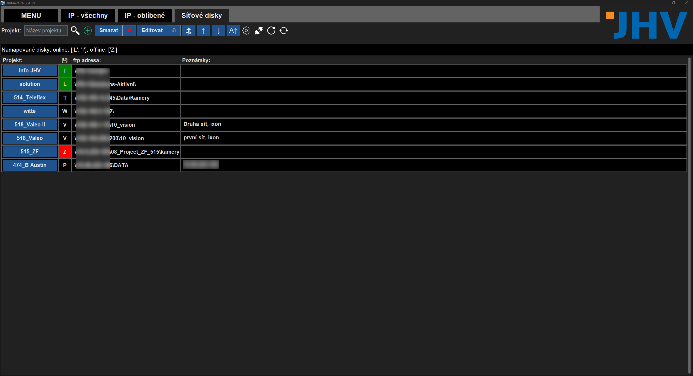

  

### Tvorba katalogu komponentů včetně kusovníku (s daty z SQL)
- GUI na sestavení katalogu + login do SQL
- filtruje komponenty z SQL databáze podle zvoleného výrobce
- možnost exportu do .xml, .xlsx, xlsm a do databáze, kde vytvoří tabulku
- možnost importu vyexportovaného projektu .xml

  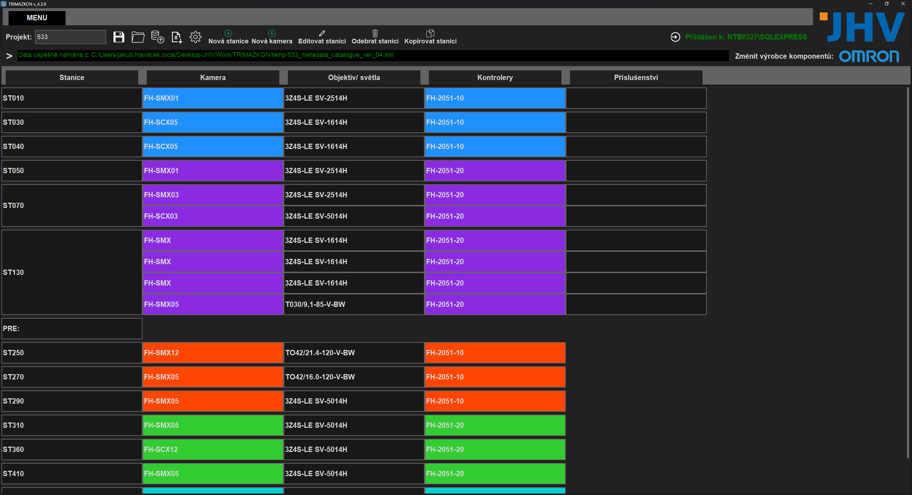

  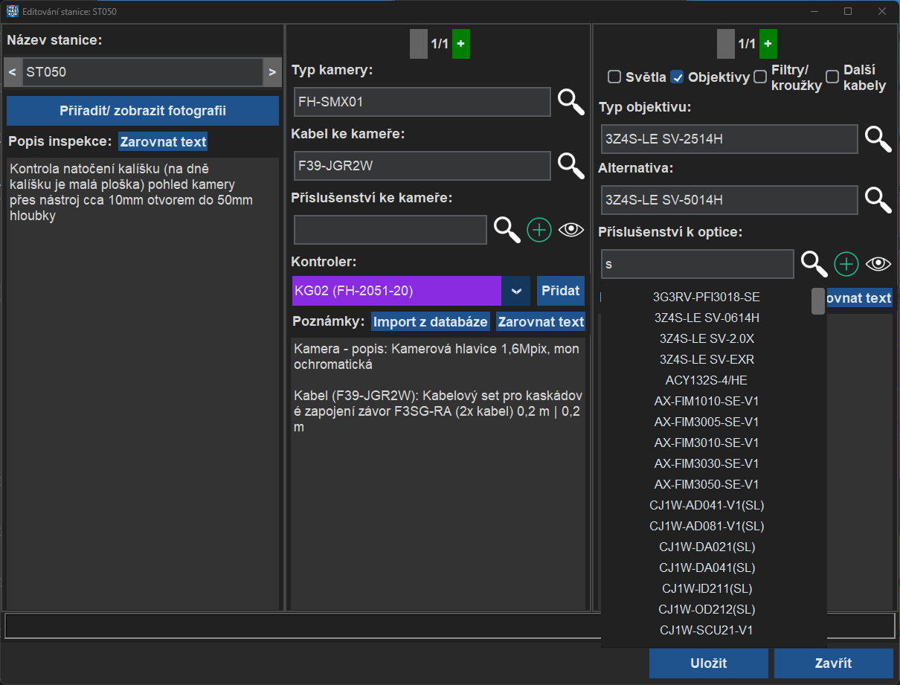

