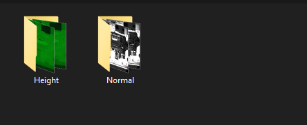

# Work
Analýza, kontrola a třídění souborů z průmyslových kamer

- vloží se cesta ke složce se soubory (Algoritmus ošetřen proti špatně zadané cestě)
- nezáleží pokud jsou soubory: 
  - smíchané přímo v cestě nebo ve složce
  - uložené ve více složkách (volí se základní)
  - jiného typu - např.: .txt atp.
  - různé délky v názvu
                              
- Algoritmus odstraňuje nevyužité, prázdné složky v cestě
- Algoritmus je ošetřen proti špatnému inputu ze strany uživatele
- Nyní je již algoritmus schopen zpracovat více formátů souboru (Nepracuje tedy, jako původně pouze se soubory typu: ".Height" a ".Normal", ale s neomezeným počtem typů).
	- Funguje na principu předpokladu podobné syntaxe názvu souboru (je splitován znakem "&")
	- Ošetřeno chybovým hlášením

## Verze 2.4 Lite:
- základní, rychlá kontrola bez možnosti vstoupit do "advanced modu"

## Verze 2.4:
- Umožnuje vstoupit do "advanced modu", kde si lze zvolit způsob třídění souborů

- Nejprve je provedeno základní třídění do OK a NOK složky:

1) třídění podle typu souboru (jako 2.4 Lite)

2) zvlášť do složek podle čísla funkce (s prefixem _Func a číslem funkce)

3) zvlášť do složek podle čísla kamery (s prefixem _Cam a číslem kamery)

4) obojí zároveň

5) manuální mód (manuální nastavení počtu zakrytých znaků)

## Verze 2.5 Lite:

- Zvláštní verze pro kontrolu odeslaných dvojic (i trojice... neomezeně) souborů za sebou (obsluha odejme paletu a opět vloží tu samou)

- funguje pouze pro případ názvu v tomto tvaru: 2023_04_13-07_11_09_xxxx_   0020   _&Cam2Img.Height
	- tzn. musi se jednat o čtyřciferné číslo nalevo od _&
	- tvar x9xx je schválně ignorován
	- maximálni počet palet v sadě je přednastaven na: 55

- Nalezené dvojice kopíruje do složky: "PAIRS", ve které je podrobně roztřídí do samostatných složek podle ID a aktuální sady

- Ve složce PAIRS:

## Verze 2.5:
- Stejné jako 2.5 Lite, jen je programovaná na spuštění ve složce, kde se nacházejí jednotlivé složky s datumy (2023_04_13) -> složky A/B -> složky Height/Normal/Gray se soubory... a projde je všechny postupně